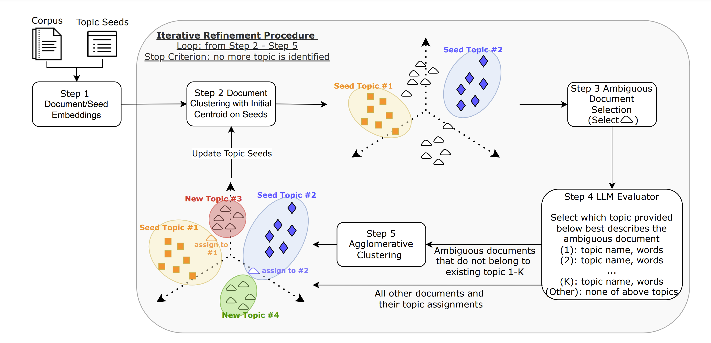

# LITA: An Efficient LLM-assisted Iterative Topic Augmentation Framework


This is the implementation of the paper "LITA: An Efficient LLM-assisted Iterative Topic Augmentation Framework". This repository contains the code for the iterated refinement process and the evaluation on two datasets: CLINC and 20NewsGroups.

## File Directory
```
.
├── datasets
│   ├── 20newsgroups
│   └── clinc_domain
│
├── main
│   ├── utils
│   ├── main.py
│   ├── get_embedding.py
│   ├── ambiguous_selecting.py
│   ├── predict_topic.py
│   ├── refinement.py
│   ├── load_save_data.py
│   ├── calculation.py
│   ├── evaluate_and_run_baselines.py
│   ├── evaluation.py
│   └── tools.py
│
├── results
│   ├── seeds_embeddings
│   ├── clustering
│   ├── sampled_ambiguous_results
│   ├── predicted_topic_results
│   ├── performance
│   └── topics
│
├── README.md
└── requirements.txt
```

## Setting Env
1. `conda create -n [ENV_NAME] python=3.9.18`
2. `pip install -r requirements.txt`

## Topic modeling and refinement
* Step 1. Seed topics
    * Set seed topics first in ```/results/topics/{dataset}/topics.json```
* Step 2. `python main.py -dataset <str: dataset> -openai_api_key <str: API_KEY> -openai_org <str: ORG>`
    * The following are the args you can change:
        * -model_name: LLM model name
        * -dataset: dataset to run topic modeling {clinc_domain, 20newsgroups}
        * -ambiguous_threshold: threshold to select ambiguous instances
        * -seed: random seed
        * -agglo_distance_threshold: distance threshold of hierarchcal clustering
        * -n_cluster: initial seed topic number
        * -openai_api_key: API KEY published by OpenAI
        * -openai_org: OpenAI Organization
* Step 3. Results
    * Main results will saved in ```/results/```
    * Our results is saved in this [link](https://drive.google.com/drive/folders/1DNFpVh8DWvMsxD04YHVYRbn6DsKW8U0f?usp=sharing).

## APIs in main.py
1. ```get_embedding()``` 
    * This API calls the function in `get_embedding.py`, the main objective is to obtain document and seed word embeddings.
    * Output paths
        * Document embedding: ```/datasets/{dataset}/{scale}_embeds.hdf5```
        * Seed word embedding: ```/results/seeds_embeddings/{dataset}/seeds_embeds_c={topic_num}.npy```
2. ```select_amb()```
    * This API calls the function in `ambiguous_selecting.py`, the main objective is to perform clustering and select ambiguous instances.
    * Output paths
        * Clustering result: ```/results/clustering/{dataset}/clustering_result_c={topic_num}.npy```
        * Ambiguous selecting result: ```/results/ambiguous_selecting_results/seeded_{dataset}_s={scale}.json```
3. ```predict()```
    * This API calls the function in `predict_topic.py`, the main objective is to use LLMs as evaluator, judging the topic of ambiguous instances.
    * Output paths
        * Topic re-assignment result: ```/results/predicted_topic_results/{dataset}/seeded_{dataset}_s={scale}-{model_name}-pred_c={n_cluster}.json```
4. ```refine()```
    * This API calls the function in `refinement.py`, the main objective is to perform the iterated refinement process for the clustering result.
    * Output paths
        * New seed embedding: ```/results/seeds_embeddings/${dataset}/seeds_embeds_c={refined_n_cluster}.npy```
        * New topics: ```/results/topics/{dataset}/topics.json```

## Evaluation and Baselines
* `evaluate_and_run_baselines.py` evaluates the main results (Table 1, Table 2) in the paper, including metrics `NPMI`, `Topic Diversity`, `NMI` and `Accuracy` and all baselines except promptTopic.
* `python evaluate_and_run_baselines.py -dataset <str: dataset> -n_cluster <int: number of cluster>`
    * Given parameters *dataset* and *n_cluster*, the results will be saved in ```/results/performance/```.
    * Note: Parameter `-n_cluster` must match the clustering results in the path ```/results/clustering/{dataset}/clustering_result_c={n_cluster}.npy``` to evaluate the results with different topic number.